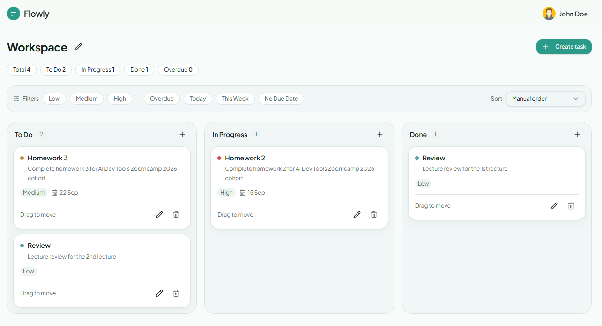
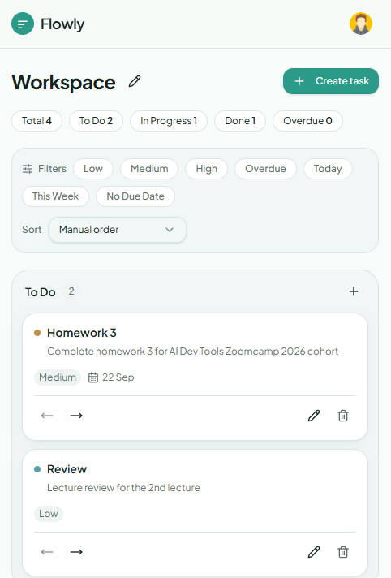
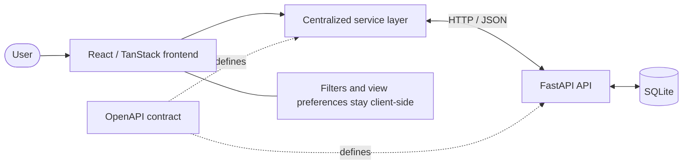

<div align="center">
  
  <h1>Flowly</h1>
  <p><strong>Keep your work in flow.</strong></p>
  <p>A full-stack personal Kanban app for organizing tasks across To Do, In Progress, and Done.</p>
  <p>
    <a href="#features">Features</a> ·
    <a href="#how-it-works">How it works</a> ·
    <a href="#quick-start">Quick start</a> ·
    <a href="#testing">Testing</a>
  </p>
  <p>
    
    
    
    
    <a href="#testing"></a>
  </p>
</div>

## 🖼️ A look at Flowly

<table>
  <tr>
    <th>Desktop board</th>
    <th>Mobile view</th>
  </tr>
  <tr>
    <td align="center">
      
    </td>
    <td align="center">
      
    </td>
  </tr>
</table>

<a id="features"></a>

## ✨ What you can do

| | |
| --- | --- |
| **Make it yours** | Sign up with email/password, keep a private board, and edit your profile and board name. A development Google sign-in stub is also available. |
| **Keep tasks moving** | Create, edit, and delete tasks. Drag to move or reorder on desktop; use explicit move controls on mobile. |
| **See what needs attention** | Set priorities and due dates, spot overdue tasks, and filter or temporarily sort without changing saved manual order. |
| **Pick up where you left off** | Accounts, boards, tasks, and sessions survive backend restarts. The responsive UI follows your system's light or dark theme. |

<a id="how-it-works"></a>

## 🧭 How it works



The backend checks ownership on private data and saves task order atomically through a separate database layer. The frontend service layer keeps API calls centralized in `frontend/src/services/`.

## 🧰 Technology

| Layer | Responsibility / Technology |
| --- | --- |
| Frontend | React, TypeScript, TanStack Start / Router and Query; Vite, Tailwind CSS, shadcn/ui |
| Backend | Python and FastAPI; uv for dependencies, pytest for tests |
| API contract | OpenAPI defines request and response shapes |
| Persistence | SQLite stores users, boards, tasks, sessions, and password-reset tokens |

<a id="quick-start"></a>

## 🚀 Quick start

You need **Node.js with npm**, **Python 3.12+**, and **uv**. Open two terminals, each starting at the repository root.

**Terminal 1 — backend**

```sh
cd backend
uv sync
uv run uvicorn app.main:app --reload --host 127.0.0.1 --port 8000
```

**Terminal 2 — frontend**

```sh
cd frontend
npm install
npm run dev
```

- **Frontend:** open the URL printed by Vite.
- **Default API:** `http://127.0.0.1:8000/api`
- **Interactive API docs:** `http://127.0.0.1:8000/docs`

See the [frontend configuration notes](frontend/README.md) and [backend setup](backend/README.md) for environment and database details.

## 🗂️ Project structure

```text
flowly/
├── frontend/          # UI and API services
├── backend/           # API, SQLite storage, and tests
├── _docs/
│   ├── assets/        # README visuals
│   └── specs.md       # Product specification
├── openapi.yaml       # API contract
├── AGENTS.md          # Development guidelines
└── README.md
```

<a id="testing"></a>

## 🧪 Testing

**Backend** — from the repository root:

```sh
cd backend
uv run pytest
```

The last verified backend run passed **39 tests**, covering API responses, authentication, ownership, task ordering, rollback, and persistence across new application instances. The badge above records that result; it is not a live CI status.

**Frontend** — from the repository root:

```sh
cd frontend
npx tsc --noEmit
npm run build
```

## 📚 Documentation

| Document | Contents |
| --- | --- |
| [Product specification](_docs/specs.md) | Product behavior and v1 scope |
| [API contract](openapi.yaml) | Frontend/backend request and response definitions |
| [Frontend README](frontend/README.md) | Setup, API configuration, sessions, and implementation notes |
| [Backend README](backend/README.md) | API, authentication, database, persistence, and test details |
| [Development guidelines](AGENTS.md) | Repository conventions and Lovable sync precautions |

## 🚧 Current limitations

- Google authentication is a development stub, not production OAuth.
- Password-reset delivery is mocked locally: tokens are logged instead of emailed.
- Collaboration and team features are outside v1.

## 🌱 Project origin

Built while following the **DataTalksClub AI Dev Tools Zoomcamp**, with Lovable for initial frontend prototyping and Codex/local agent work for later full-stack development.

The repository remains connected to the [Lovable editor](https://lovable.dev/projects/f0d7cabb-3649-46f3-8e8e-2f2056adae92). Changes pushed to the connected branch sync back to Lovable; avoid rewriting published Git history.
